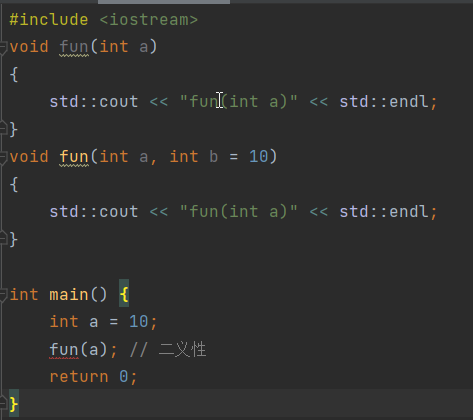
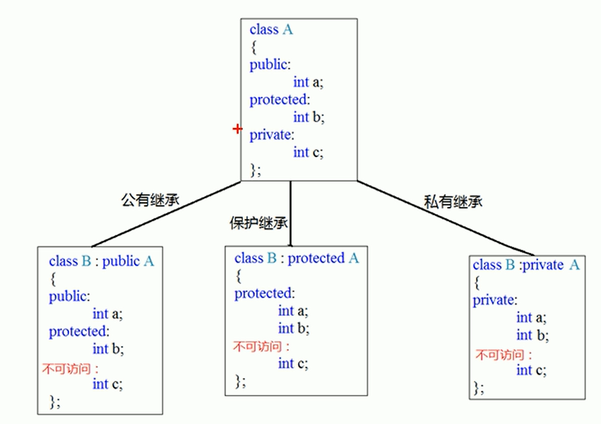
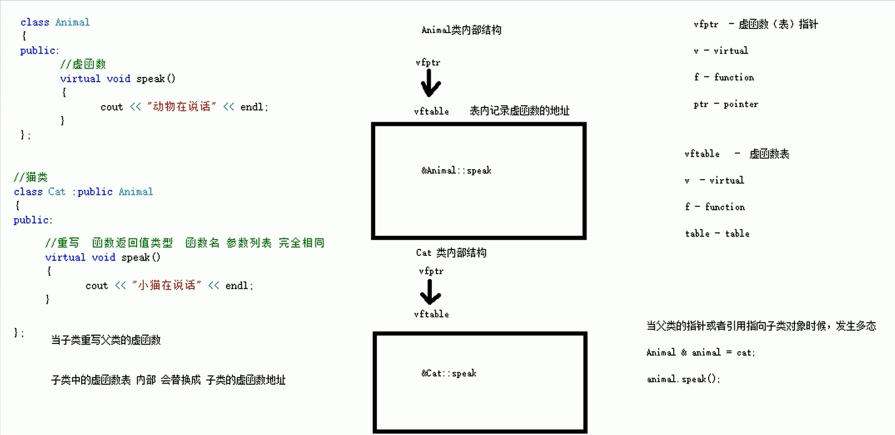
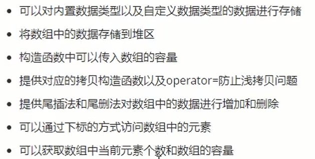
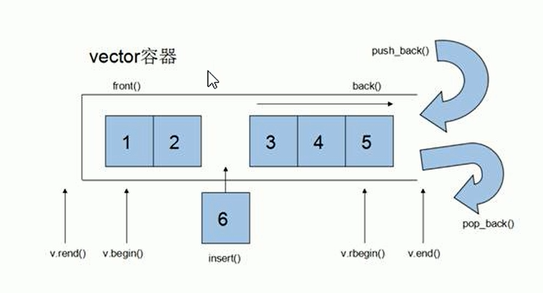
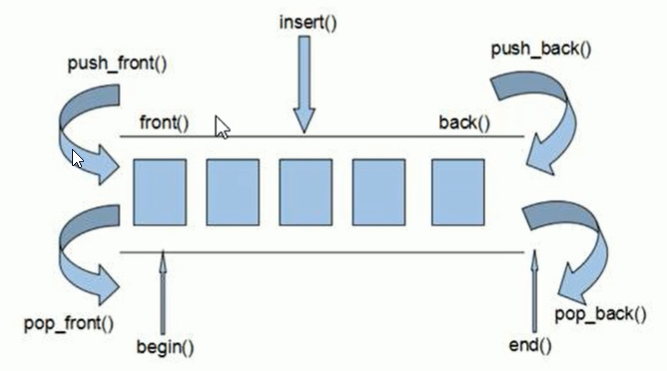
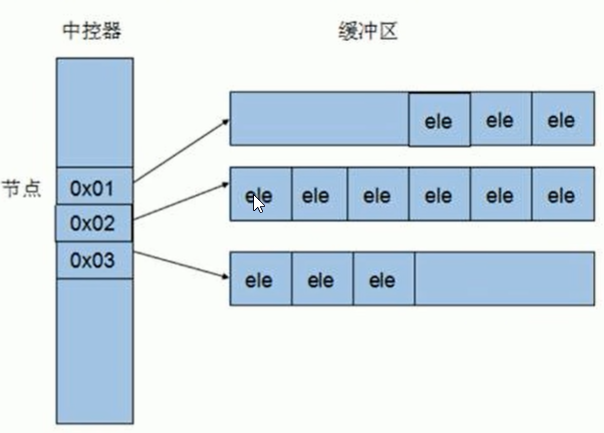
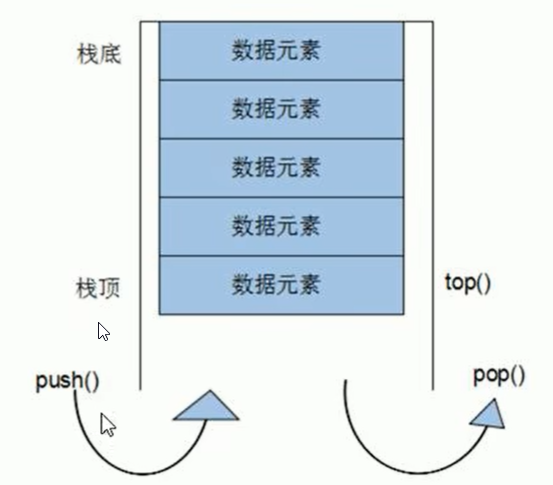
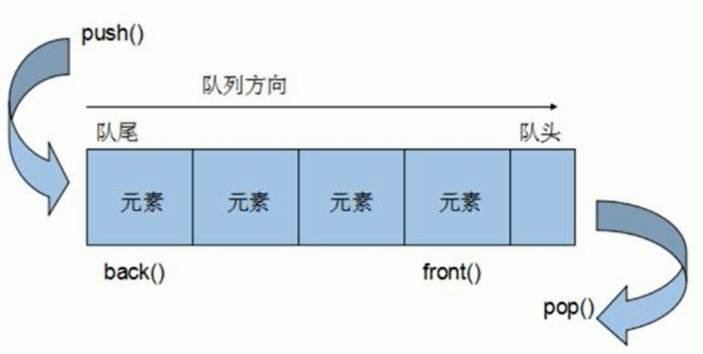
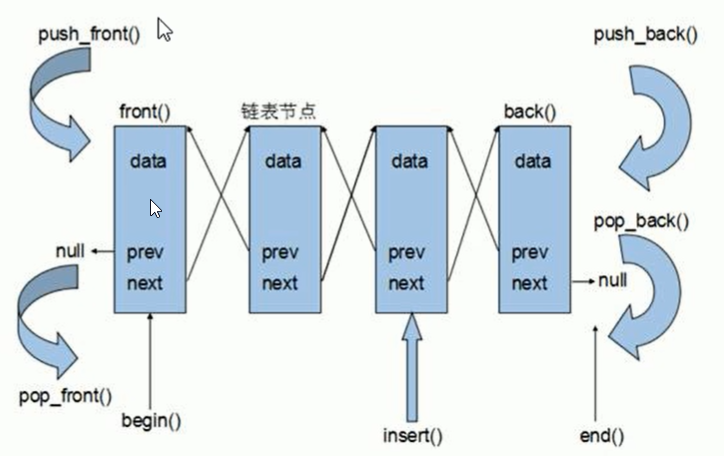

# C++ 基础学习

## 引用

- 语法：数据类型 &别名 = 原名;

- 示例：

  ```C++
  int a = 10;
  int &b = a;
  ```

- 本质：指针常量

  示例代码本质为：`int * const b = &a`

- 注意事项：

  1. 引用必须要初始化
  2. 引用一旦初始化后，不允许改变

- 示例代码

  ```C++
  #include <iostream>
  
  int main() {
  
      int a = 10;
      int &b = a;
      std::cout << "a : " << a << std::endl;
      std::cout << "b : " << b << std::endl;
  
      b = 20;
      std::cout << "a : " << a << std::endl;
      std::cout << "b : " << b << std::endl;
  
      return 0;
  }
  ```

### 引用作函数入口参数

```c++
#include <iostream>

// 值传递
void mySwap01(int a, int b)
{
    int temp = a;
    a = b;
    b = temp;
}

// 指针传递
void mySwap02(int *a, int *b)
{
    int temp = *a;
    *a = *b;
    *b = temp;
}

// 引用
void mySwap03(int &a, int &b)
{
    int temp = a;
    a = b;
    b = temp;
}


int main() {
    int a = 10;
    int b = 20;
    mySwap01(a, b); /* 形参不修饰实参 */
    std::cout << "a : " << a << std::endl;
    std::cout << "b : " << b << std::endl;
    mySwap02(&a, &b); /* 形参修饰实参 */
    std::cout << "a : " << a << std::endl;
    std::cout << "b : " << b << std::endl;
    mySwap03(a, b); /* 形参修饰实参 */
    std::cout << "a : " << a << std::endl;
    std::cout << "b : " << b << std::endl;
    return 0;
}
/* 输出：
a : 10
b : 20
a : 20
b : 10
a : 10
b : 20
*/
```

### 引用作函数返回值

> 1. 不要返回局部变量的引用
>
> 2. 函数的调用可以作为左值

```c++
#include <iostream>

int& test01()
{
    int a = 10; // 局部变量，栈区
    return a; // 编译器会有警告
}

int& test02()
{
    static int a = 10; // 静态变量，全局区
    return a;
}
int main() {
    int &ref = test02(); //
    std::cout << "ref:" << ref << std::endl;
    test02() = 1000; // 左值
    std::cout << "ref:" << ref << std::endl;
    return 0;
}
/* 输出：
ref:10
ref:1000
*/
```

## 函数高级

### 函数默认参数

1. 如果函数声明有默认参数，函数定义就不能有默认参数
2. 如果某个位置参数有默认值，那么从这个位置往后，都要有默认值

### 函数重载

1. 作用：函数名可以相同，提高复用性

2. 满足条件：

   1. 同一个作用域下
   2. 函数名称相同
   3. 函数参数类型不同 或 个数不同 或 顺序不同

3. 注意事项：

   1. 函数返回值不能作为函数重载的条件

   2. 引用作为重载条件

      ```c++
      #include <iostream>
      void fun(int &a)
      {
          std::cout << "fun(int &a)" << std::endl;
      }
      
      void fun(const int &a)
      {
          std::cout << "fun(const int &a)" << std::endl;
      }
      int main() {
          int a = 10;
          const int b = 10;
          fun(a);
          fun(b);
          return 0;
      }
      ```

   3. 函数重载碰到默认参数

      

## 封装

### 封装的意义

- 将属性和行为作为一个整体，表现生活中的事物
- 将属性和行为加以权限控制

## C++对象模型和this指针

### 成员变量和成员函数

**静态成员变量**

1. 所有对象共享同一份内存
2. 编译阶段就分配内存
3. 类内声明`static int A`，类外进行初始化`int Person::A = 1`

​     静态成员变量不属于某个对象上，所有对象都共享同一份数据，因此静态成员变量有两种访问方式：

1. 通过对象进行访问 `p.A`
2. 通过类名进行访问 `Person::A` public权限

访问权限：类外访问不到私有静态变量

**静态成员函数**

1. 所有对象共享同一个函数
2. 静态成员函数只能访问静态成员变量

访问方式：

1. 通过对象访问
2. 通过类名访问

访问权限：类外访问不到私有静态函数

**成员变量和成员函数存储**

1. 非静态成员变量，属于类的对象上
2. 静态成员变量，不属于类的对象上
3. 静态成员函数，不属于类的对象上
4. 非静态成员变量，不属于类的对象上

```
class A{} 空对象占用1字节
class B{
	int a;
	static int b;
	void fun();
	static void fun2()
} 占用4字节，只有a属于类的对象
```

### this指针概念

1. 解决名称冲突（当形参与成员变量名称相同时）
2. 返回对象本身用`*this`（链式编程）

### const修饰成员函数

**常函数**

- 成员函数后加const成常函数
- 常函数内不可以修改成员属性
- 成员属性声明时加关键字mutable后，在常函数内依然可以修改

**常对象**

- 声明对象前加const成常对象
- 常对象只能调用常函数

## 友元

目的：让一个函数或类访问另一个类中的私有成员  

关键字：friend

三种实现：

1. 全局函数做友元

   ```c++
   #include <iostream>
   
   using namespace std;
   class Building
   {
       /* 将全局函数放在类中前加friend即可 */
       friend void goodGay(Building *building);
   public:
       Building()
       {
           m_SittingRoom = "sitting room";
           m_BedRoom = "bed room";
       }
       string m_SittingRoom;
   
   private:
       string m_BedRoom;
   };
   
   void goodGay(Building *building)
   {
       cout << "good friend is visiting " << building->m_SittingRoom << endl;
       cout << "good friend is visiting " << building->m_BedRoom << endl;
   }
   
   int main() {
       Building building;
       goodGay(&building);
       return 0;
   }
   ```

2. 类做友元

   ```c++
   #include <iostream>
   #include <string>
   using namespace std;
   class GoodGay;
   class Building
   {
       /* 可以访问私有权限 */
       friend class GoodGay;
   public:
       Building()
       {
           m_SittingRoom = "sitting room";
           m_BedRoom = "bed room";
       }
       string m_SittingRoom;
   
   private:
       string m_BedRoom;
   };
   
   class GoodGay
   {
   public:
       Building *building;
       GoodGay()
       {
           this->building = new Building;
       }
       void visit()// 访问Building中的属性
       {
           cout << "good friend is visiting " << building->m_SittingRoom << endl;
           cout << "good friend is visiting " << building->m_BedRoom << endl;
       }
   
   };
   
   int main() {
       GoodGay gay;
       gay.visit();
       return 0;
   }
   ```

3. 成员函数做友元

   ```c++
   friend void GoodGay::visit();
   ```

## 运算符重载

- 加号运算符重载

  ```
  Person operator+(Person &p1,Person &p2)
  {
  	Person temp;
  	temp.a = p1.a + p2.a;
  	return temp;
  }
  Person operator+(Person &p1,int num)
  {
  	Person temp;
  	temp.a = p1.a + num;
  	return temp;
  }
  Person p3 = p1 + p2;
  Person p3 = p1 + 10;
  ```

## 继承



继承中的构造和析构顺序：

- 构造：先父类，后子类
- 析构：先子类，后父类

如果通过子类成员访问父类中的同名属性或函数需要加上父类作用域 

## 多态

当子类重写父类的虚函数时，子类的虚函数表内部会替换成子类的虚函数表。当父类的指针或引用指向子类对象时，发生多态



**多态好处**

- 组织结构清晰
- 可读性强
- 可维护性好

**纯虚函数和抽象类**

​		在多态中，通常父类中的虚函数的实现是毫无意义的，主要都是调用子类重写的内容，因此可以将虚函数改为纯虚函数。

纯虚函数语法：`virtual 返回值类型 函数名 （参数列表）= 0；`

当类中有了纯虚函数，这个类也叫抽象类

抽象类特点：

- 无法实例化对象
- 子类必须重写抽象类中的纯虚函数，否装也属于抽象类

虚虚构和纯虚析构

多态使用时，如果子类中有属性开辟到堆区，那么父类指针在释放时无法调用到子类的析构代码

解决方式：将父类中的析构函数改为虚析构或纯虚析构

虚析构或纯虚析构的共性：

- 可以解决父类释放子类对象
- $\color{#FF0000}{都需要有具体的函数实现}$ 

区别： 

- 如果是纯虚析构，该类属于抽象类，无法实例化对象

虚析构语法：`virtual ~类名(){}`

纯虚析构语法：`virtual ~类名()=0`

​							`类名::~类名(){}`

## 模板

### 函数模板

```c++
template <class T>
函数
```

**示例**

```c++
template <class T>
void swap(T &a, T &b)
{
	T temp;
	temp = a; a = b; b = temp;
}
```

**调用**

```c++
int a = 10, b = 20;
swap(a, b); // 自动类型转换，不会发生隐式类型转换
swap<int>(a, b); // 指定类型转换，会发生隐式类型转换
```

### 类模板

```c++
template <class T>
类
```

**示例**

```c++
template <class T>
// class Person(T NameType, T AgeType=int)//可以有默认参数
class Person(T NameType, T AgeType)
{
public:
	Person(NameType name, AgeType age)
    {
        this->m_Name = name;
        this->m_Age = age;
    }
    NameType m_Name;
    AgeType m_Age;
};
```

**调用**

```c++
Person<string, int> p("Peter", 100);//只能显示调用
```

 ### 案例

要求如下：



```c++
//
// Created by F_188 on 2022/8/4.
//
#ifndef FRIEND_MYARRAY_H
#define FRIEND_MYARRAY_H
#include <iostream>

using namespace std;

template <class T>
class MyArray {

public:
    MyArray(int capacity) // 有参构造
    {
        this->m_Capacity = capacity;
        this->m_Size = 0;
        this->pAddress = new T[this->m_Capacity];
    }

    // 拷贝构造
    MyArray(const MyArray& arr)
    {
        this->m_Capacity = arr.m_Capacity;
        this->m_Size = arr.m_Size;
//        this->pAddress = arr.pAddress; // 浅拷贝

        this->pAddress = new T[arr.m_Capacity]; //深拷贝，重新分配空间
        //拷贝数据
        for (int i = 0; i < this->m_Size; i++) {
            this->pAddress[i] = arr.pAddress[i];
        }
    }

    // operator= 防止浅拷贝问题
    MyArray& operator=(const MyArray &arr)
    {
        // 先判断原来堆区是否有数据，如果有先释放
        if(this->pAddress != NULL)
        {
            delete[] this->pAddress;
            this->pAddress = NULL;
            this->m_Capacity = 0;
            this->m_Size = 0;
        }
        // 深拷贝
        this->m_Capacity = arr.m_Capacity;
        this->m_Size = arr.m_Size;
        this->pAddress = new T[arr.m_Capacity];
        for(int i = 0; i < this->m_Size; i++)
        {
            this->pAddress[i] = arr.pAddress[i];
        }
        return *this;
    }

    ~MyArray()
    {
        if(this->pAddress != NULL)
        {
            delete[] this->pAddress;
            this->pAddress = nullptr;
        }
    }

    // 尾插法
    void Push_Back(const T & val)
    {
        if(this->m_Capacity == this->m_Size) return;
        this->pAddress[this->m_Size] = val;
        this->m_Size ++;
    }

    //尾删法
    void Pop_Back()
    {
        // 让用户访问不到最后一个元素即可。逻辑删除
        if(this->m_Size == 0) return;
        this->m_Size --;
    }
    // 通过下标访问数组中的元素
    T & operator[](int index)
    {
//        if(index > this->m_Size) return
        return this->pAddress[index];
    }
    //返回数组容量
    int getCapacity()
    {
        return m_Capacity;
    }
    //返回数组大小
    int getSize()
    {
        return m_Size;
    }
private:
    T *pAddress; // 指针指向堆区开辟的真实数组
    int m_Capacity; // 数组容量
    int m_Size; //数组大小
};


#endif //FRIEND_MYARRAY_H

```

```c++
#include <iostream>
#include <string>

#include "MyArray.h"
using namespace std;

void printIntArr(MyArray<int> &arr)
{
    for (int i = 0; i < arr.getSize(); i++)
    {
        cout << arr[i] << endl;
    }
}

void test01()
{
    MyArray<int>arr1(5);
    for (int i = 0; i < 5; i++)
    {
        arr1.Push_Back(i);
    }
    cout << "arr1" << endl;
    printIntArr(arr1);
    cout << "arr2" << endl;
    MyArray<int>arr2(arr1);
    arr2.Pop_Back();
    printIntArr(arr2);
    cout << "arr2 capacity:" << arr2.getCapacity() << endl;
    cout << "arr2 size:" << arr2.getSize() << endl;
//    MyArray<int>arr3(100);
//    arr3 = arr1;
}

// 测试自定义数据类型
class Person
{
public:
    Person(){};
    Person(string name, int age){
        this->m_Name = name;
        this->m_Age = age;
    };
    string  m_Name;
    int m_Age;
};

void printPersonArr(MyArray<Person> &arr)
{
    for (int i = 0; i < arr.getSize(); i++)
    {
        cout << "name: " << arr[i].m_Name << " age:" << arr[i].m_Age << endl;
    }
}

void test()
{
    MyArray<Person> arr(10);
    Person p1("A", 10);
    Person p2("B", 20);
    Person p3("C", 30);
    Person p4("D", 40);
    Person p5("E", 50);
    //将数据插入导容器中
    arr.Push_Back(p1);
    arr.Push_Back(p2);
    arr.Push_Back(p3);
    arr.Push_Back(p4);
    arr.Push_Back(p5);

    printPersonArr(arr);
}
int main() {
    test();
    return 0;
}
```

## STL

六大组件：容器、算法、迭代器、仿函数、适配器、空间配置器。

1. 容器：各种数据结构，如vector、list、deque、set、map等
2. 算法：各种常用的算法，如sort、find、copy、for_each等
3. 迭代器：扮演了容器与算法之间的胶合剂
4. 仿函数：行为类似函数，可作为算法的某种策略
5. 适配器：
6. 空间配置器

### 容器、算法、迭代器

```c++
    vector<int> v;
    v.push_back(10);
    v.push_back(20);
#if 0
    vector<int>::iterator itBegin = v.begin();
    vector<int>::iterator  itEnd = v.end();//指向容器中
    while (itBegin != itEnd)
        cout << *(itBegin++) << endl;
#endif
    for (vector<int>::iterator it = v.begin();  it != v.end(); it++) {
        cout << *it << endl;
    }
```

### string容器

### vector容器

**功能**：vector数据结构和数组非常相似，也称单端数组。

**vector与普通数组的区别**：数组是静态空间，vector可以动态扩展

**动态扩展**：并不是在原空间之后续接新空间，而是找更大的内存空间，然后将原数据拷贝新空间，释放原空间。



巧用`swap`可以收缩空间：`vector<int>(v).swap(v);`，`vector(int)(v)`匿名对象，程序发现其是匿名对象后会回收它的空间

`reserve`：预留空间，减少为vector开辟内存次数

```c++
vector<int> v;
v.reserve(100000); // 预先开辟空间
int number = 0; // 统计开辟次数
int *ptr = NULL;
for(int i = 0; i < 100000; i++)
{
    v.push_back(i);
    if(ptr != &v[0])
    {
        ptr = &v[0];
        number ++;
    }
}
cout << "number = " << number << endl;
// 未reserve前 number = 18，后 number = 1
```

### deque容器

​		双端数组，可以对头部进行插入和删除

deque与vector的区别:

- vector对头部的插入删除效率低，数据量越大，效率越低
- deque对头部插入删除速度比vector快
- vector访问元素时的速度会比deque快，这和两者内部实现有关



deque内部工作原理：

deque内部有个**中控器**，维护每段缓冲区中的内容，缓冲区中存放真实数据，中控器维护的是每个缓冲区的地址，使得使用deque时像一片连续的空间



deque容器的迭代器也支持随机访问。

### stack容器

stack容器是一种**先进后出**的数据结构，它只有一个出口。栈中只有顶端的元素才可以被外界使用，因此栈不允许有遍历行为。

 

### queue容器

queue是一种**先进先出**的数据结构，它有两个出口。

队列容器允许从一端新增元素，从另一端移除元素

队列中只有队头和队尾才可以被外界使用，因此队列不允许遍历



### list容器

链表，将数据进行链式存储。可以对任意的位置进行快速插入和删除元素，但是遍历的速度没有数组快，占用空间比数组大

节点的组成：一个存储数据元素的数据域，一个存储下一个节点的指针域



链表的存储方式并不是连续的内存空间，因此链表的迭代器只支持前移和后移，属于双向迭代器。

优点：

- 采用动态内存分配，不会造成内存浪费和溢出
- 链表执行插入和删除操作十分方便，修改指针即可，不需要移动大量数据

缺点：

- 链表灵活，但是指针域（空间）和遍历（时间）额外耗费较大

list有一个重要的性质，插入操作和删除操作都不会造成原有list迭代器的失效，这在vector是不成立的

### set容器


```
class MyCompare{ 
public:
	bool operator()(int a, int b)
	{
		return a > b;
	}
};
```

默认从小到大，指定排序为从大到小：在插数据之前 `set<int,MyCompare>s;`，利用**仿函数**指定容器排序规则。

### map容器

​		map/multimap属于关联式容器，底层结构是二叉树实现

- map中所有元素都是pair
- pair中第一个元素为key键值，起到索引作用，第二个元素为value实值
- 所有元素都会根据元素的键值自动排序

优点：可以根据key值快速找到value值

map和multimap的区别：

- map不允许容器中有重复的key值元素
- multimap允许容器中有重复的key值元素

### 函数对象

概念：

- 重载函数调用操作符的类，其对象常称为函数对象
- 函数对象使用重载时，行为类似函数调用，也叫仿函数

本质：函数对象（仿函数）是一个类，不是一个函数

使用：

- 函数对象在使用时，可以像普通函数那样调用，可以有参数，可以有返回值

  ```c++
  class MyAdd
  {
  public:
      int operator()(int v1,int v2)
      {
          return v1 + v2;
      }
  };
  
  void test01()
  {
      MyAdd myAdd;
      cout << myAdd(10, 5) << endl;
  }
  ```

  

- 函数对象超出普通函数的概念，函数对象可以有自己的状态

  ```c++
  class MyPrint
  {
  public:
      MyPrint()
      {
          this->count = 0;
      }
      int operator()(string s)
      {
          cout << s << endl;
          this->count++;
      }
      int count;
  };
  void test02()
  {
      MyPrint myPrint;
      myPrint("Hello");
      myPrint("Hello");
      myPrint("Hello");
      cout << myPrint.count << endl;
  }
  ```

  

- 函数对象可以作为参数传递

  ```
  void doPrint(MyPrint &mp, string test)
  {
      mp(test);
  }
  void test03()
  {
      MyPrint mp;
      doPrint(mp, "Hello world");
  }
  ```

  ### 谓词

  概念：

  - 返回bool类型的仿函数称为谓词
  - 如果operator()接受一个参数，那么叫一元谓词
  - 如果operator()接受二个参数，那么叫二元谓词

  
  
  
  
  

