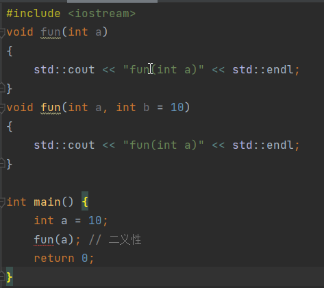
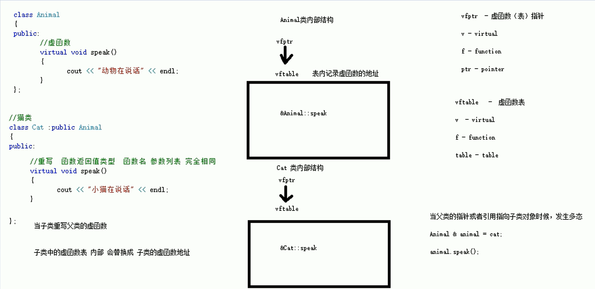

# C++学习

## 引用

- 语法：数据类型 &别名 = 原名;

- 示例：

  ```C++
  int a = 10;
  int &b = a;
  ```

- 本质：指针常量

  示例代码本质为：`int * const b = &a`

- 注意事项：

  1. 引用必须要初始化
  2. 引用一旦初始化后，不允许改变

- 示例代码

  ```C++
  #include <iostream>
  
  int main() {
  
      int a = 10;
      int &b = a;
      std::cout << "a : " << a << std::endl;
      std::cout << "b : " << b << std::endl;
  
      b = 20;
      std::cout << "a : " << a << std::endl;
      std::cout << "b : " << b << std::endl;
  
      return 0;
  }
  ```

### 引用作函数入口参数

```c++
#include <iostream>

// 值传递
void mySwap01(int a, int b)
{
    int temp = a;
    a = b;
    b = temp;
}

// 指针传递
void mySwap02(int *a, int *b)
{
    int temp = *a;
    *a = *b;
    *b = temp;
}

// 引用
void mySwap03(int &a, int &b)
{
    int temp = a;
    a = b;
    b = temp;
}


int main() {
    int a = 10;
    int b = 20;
    mySwap01(a, b); /* 形参不修饰实参 */
    std::cout << "a : " << a << std::endl;
    std::cout << "b : " << b << std::endl;
    mySwap02(&a, &b); /* 形参修饰实参 */
    std::cout << "a : " << a << std::endl;
    std::cout << "b : " << b << std::endl;
    mySwap03(a, b); /* 形参修饰实参 */
    std::cout << "a : " << a << std::endl;
    std::cout << "b : " << b << std::endl;
    return 0;
}
/* 输出：
a : 10
b : 20
a : 20
b : 10
a : 10
b : 20
*/
```

### 引用作函数返回值

> 1. 不要返回局部变量的引用
>
> 2. 函数的调用可以作为左值

```c++
#include <iostream>

int& test01()
{
    int a = 10; // 局部变量，栈区
    return a; // 编译器会有警告
}

int& test02()
{
    static int a = 10; // 静态变量，全局区
    return a;
}
int main() {
    int &ref = test02(); //
    std::cout << "ref:" << ref << std::endl;
    test02() = 1000; // 左值
    std::cout << "ref:" << ref << std::endl;
    return 0;
}
/* 输出：
ref:10
ref:1000
*/
```

## 函数高级

### 函数默认参数

1. 如果函数声明有默认参数，函数定义就不能有默认参数
2. 如果某个位置参数有默认值，那么从这个位置往后，都要有默认值

### 函数重载

1. 作用：函数名可以相同，提高复用性

2. 满足条件：

   1. 同一个作用域下
   2. 函数名称相同
   3. 函数参数类型不同 或 个数不同 或 顺序不同

3. 注意事项：

   1. 函数返回值不能作为函数重载的条件

   2. 引用作为重载条件

      ```c++
      #include <iostream>
      void fun(int &a)
      {
          std::cout << "fun(int &a)" << std::endl;
      }
      
      void fun(const int &a)
      {
          std::cout << "fun(const int &a)" << std::endl;
      }
      int main() {
          int a = 10;
          const int b = 10;
          fun(a);
          fun(b);
          return 0;
      }
      ```

   3. 函数重载碰到默认参数

      

## 封装

### 封装的意义

- 将属性和行为作为一个整体，表现生活中的事物
- 将属性和行为加以权限控制

## C++对象模型和this指针

### 成员变量和成员函数

**静态成员变量**

1. 所有对象共享同一份内存
2. 编译阶段就分配内存
3. 类内声明`static int A`，类外进行初始化`int Person::A = 1`

​     静态成员变量不属于某个对象上，所有对象都共享同一份数据，因此静态成员变量有两种访问方式：

1. 通过对象进行访问 `p.A`
2. 通过类名进行访问 `Person::A` public权限

访问权限：类外访问不到私有静态变量

**静态成员函数**

1. 所有对象共享同一个函数
2. 静态成员函数只能访问静态成员变量

访问方式：

1. 通过对象访问
2. 通过类名访问

访问权限：类外访问不到私有静态函数

**成员变量和成员函数存储**

1. 非静态成员变量，属于类的对象上
2. 静态成员变量，不属于类的对象上
3. 静态成员函数，不属于类的对象上
4. 非静态成员变量，不属于类的对象上

```
class A{} 空对象占用1字节
class B{
	int a;
	static int b;
	void fun();
	static void fun2()
} 占用4字节，只有a属于类的对象
```

### this指针概念

1. 解决名称冲突（当形参与成员变量名称相同时）
2. 返回对象本身用`*this`（链式编程）

### const修饰成员函数

**常函数**

- 成员函数后加const成常函数
- 常函数内不可以修改成员属性
- 成员属性声明时加关键字mutable后，在常函数内依然可以修改

**常对象**

- 声明对象前加const成常对象
- 常对象只能调用常函数

## 友元

目的：让一个函数或类访问另一个类中的私有成员  

关键字：friend

三种实现：

1. 全局函数做友元

   ```c++
   #include <iostream>
   
   using namespace std;
   class Building
   {
       /* 将全局函数放在类中前加friend即可 */
       friend void goodGay(Building *building);
   public:
       Building()
       {
           m_SittingRoom = "sitting room";
           m_BedRoom = "bed room";
       }
       string m_SittingRoom;
   
   private:
       string m_BedRoom;
   };
   
   void goodGay(Building *building)
   {
       cout << "good friend is visiting " << building->m_SittingRoom << endl;
       cout << "good friend is visiting " << building->m_BedRoom << endl;
   }
   
   int main() {
       Building building;
       goodGay(&building);
       return 0;
   }
   ```

2. 类做友元

   ```c++
   #include <iostream>
   #include <string>
   using namespace std;
   class GoodGay;
   class Building
   {
       /* 可以访问私有权限 */
       friend class GoodGay;
   public:
       Building()
       {
           m_SittingRoom = "sitting room";
           m_BedRoom = "bed room";
       }
       string m_SittingRoom;
   
   private:
       string m_BedRoom;
   };
   
   class GoodGay
   {
   public:
       Building *building;
       GoodGay()
       {
           this->building = new Building;
       }
       void visit()// 访问Building中的属性
       {
           cout << "good friend is visiting " << building->m_SittingRoom << endl;
           cout << "good friend is visiting " << building->m_BedRoom << endl;
       }
   
   };
   
   int main() {
       GoodGay gay;
       gay.visit();
       return 0;
   }
   ```

3. 成员函数做友元

   ```c++
   friend void GoodGay::visit();
   ```

## 运算符重载

- 加号运算符重载

  ```
  Person operator+(Person &p1,Person &p2)
  {
  	Person temp;
  	temp.a = p1.a + p2.a;
  	return temp;
  }
  Person operator+(Person &p1,int num)
  {
  	Person temp;
  	temp.a = p1.a + num;
  	return temp;
  }
  Person p3 = p1 + p2;
  Person p3 = p1 + 10;
  ```

## 继承


继承中的构造和析构顺序：

- 构造：先父类，后子类
- 析构：先子类，后父类

如果通过子类成员访问父类中的同名属性或函数需要加上父类作用域 

## 多态

当子类重写父类的虚函数时，子类的虚函数表内部会替换成子类的虚函数表。当父类的指针或引用指向子类对象时，发生多态



**多态好处**

- 组织结构清晰
- 可读性强
- 可维护性好

**纯虚函数和抽象类**

​		在多态中，通常父类中的虚函数的实现是毫无意义的，主要都是调用子类重写的内容，因此可以将虚函数改为纯虚函数。

纯虚函数语法：`virtual 返回值类型 函数名 （参数列表）= 0；`

当类中有了纯虚函数，这个类也叫抽象类

抽象类特点：

- 无法实例化对象
- 子类必须重写抽象类中的纯虚函数，否装也属于抽象类

虚虚构和纯虚析构

多态使用时，如果子类中有属性开辟到堆区，那么父类指针在释放时无法调用到子类的析构代码

解决方式：将父类中的析构函数改为虚析构或纯虚析构

虚析构或纯虚析构的共性：

- 可以解决父类释放子类对象
- $\color{#FF0000}{都需要有具体的函数实现}$ 

区别：

- 如果是纯虚析构，该类属于抽象类，无法实例化对象

虚析构语法：`virtual ~类名(){}`

纯虚析构语法：`virtual ~类名()=0`

​							`类名::~类名(){}`