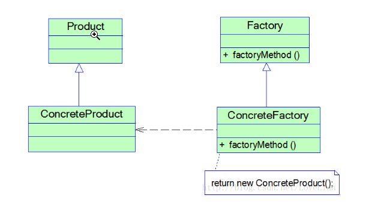

# 设计模式

- [x] $\color{black}{设计原则}$
- [x] $\color{red}{简单工厂模式}$
- [x] $\color{red}{工厂方法模式}$
- [x] $\color{red}{抽象工厂模式}$
- [ ] $\color{red}{单例模式}$
- [ ] $\color{red}{原型模式}$
- [ ] $\color{red}{建造者模式}$
- [ ] $\color{blue}{适配器模式}$
- [ ] $\color{blue}{桥接模式}$
- [ ] $\color{blue}{组合模式}$
- [ ] $\color{blue}{装饰模式}$
- [ ] $\color{blue}{外观模式}$
- [ ] $\color{blue}{享元模式}$
- [ ] $\color{blue}{代理模式}$
- [ ] $\color{green}{职责链模式}$
- [ ] $\color{green}{命令模式}$
- [ ] $\color{green}{解释器模式}$
- [ ] $\color{green}{迭代器模式}$
- [ ] $\color{green}{中介者模式}$
- [ ] $\color{green}{备忘录模式}$
- [ ] $\color{green}{观察者模式}$
- [ ] $\color{green}{状态模式}$
- [ ] $\color{green}{策略模式}$
- [ ] $\color{green}{模板方法模式}$
- [ ] $\color{green}{访问者模式}$

## 设计原则

1. 单一职责原则

> 一个类只负责一个功能领域中的相应职责，或者可以定义为：就一个类而言，应该只有一个引起它变化的原因。

2. 开闭原则

>  一个软件实体应当对扩展开放，对修改关闭。即软件实体应尽量在不修改原有代码的情况下进行扩展

3. 里氏代换原则

> 所有引用基类（父类）的地方必须能透明地使用其子类的对象。

4. 依赖倒置原则

>  抽象不应该依赖于细节，细节应当依赖于抽象。换言之，要针对接口编程，而不是针对实现编程 

​		依赖倒转原则要求我们在程序代码中传递参数时或在关联关系中，尽量引用层次高的抽象层类，即使用接口和抽象类进行变量类型声明、参数类型声明、方法返回类型声明，以及数据类型的转换等，而不要用具体类来做这些事情。

5. 接口隔离原则

> 使用多个专门的接口，而不使用单一的总接口，即客户端不应该依赖那些它不需要的接口。

6. 合成复用原则

> 尽量使用对象组合，而不是继承来达到复用的目的。

7. 迪米特法则

> 一个软件实体应当尽可能少地与其他实体发生相互作用。

## 工厂模式

### 简单工厂模式

> 简单工厂模式(Simple Factory Pattern)：定义一个工厂类，它可以根据参数的不同返回不同类的实例，被创建的实例通常都具有共同的父类。因为在简单工厂模式中用于创建实例的方法是静态(static)方法，因此简单工厂模式又被称为静态工厂方法(Static Factory Method)模式，它属于类创建型模式。 

​                                                                                   

- Factory（工厂角色）：工厂角色即工厂类，它是简单工厂模式的核心，负责实现创建所有产品实例的内部逻辑；工厂类可以被外界直接调用，创建所需的产品对象；在工厂类中提供了静态的工厂方法`factoryMethod()`，它的返回类型为抽象产品类型Product。

- Product（抽象产品角色）：它是工厂类所创建的所有对象的父类，封装了各种产品对象的公有方法，它的引入将提高系统的灵活性，使得在工厂类中只需定义一个通用的工厂方法，因为所有创建的具体产品对象都是其子类对象。

- Concrete Product（具体产品角色）：它是简单工厂模式的创建目标，所有被创建的对象都充当这个角色的某个具体类的实例。每一个具体产品角色都继承了抽象产品角色，需要实现在抽象产品中声明的抽象方法。

​		在简单工厂模式中，客户端通过工厂类来创建一个产品类的实例，而无须直接使用new关键字来创建对象，它是工厂模式家族中最简单的一员。

**总结**
      简单工厂模式提供了专门的工厂类用于创建对象，将对象的创建和对象的使用分离开，它作为一种最简单的工厂模式在软件开发中得到了较为广泛的应用。

1. 主要优点

​		简单工厂模式的主要优点如下：

(1) 工厂类包含必要的判断逻辑，可以决定在什么时候创建哪一个产品类的实例，客户端可以免除直接创建产品对象的职责，而仅仅“消费”产品，简单工厂模式实现了对象创建和使用的分离。

(2) 客户端无须知道所创建的具体产品类的类名，只需要知道具体产品类所对应的参数即可，对于一些复杂的类名，通过简单工厂模式可以在一定程度减少使用者的记忆量。

(3) 通过引入配置文件，可以在不修改任何客户端代码的情况下更换和增加新的具体产品类，在一定程度上提高了系统的灵活性。

2. 主要缺点

   简单工厂模式的主要缺点如下：

   (1) 由于工厂类集中了所有产品的创建逻辑，职责过重，一旦不能正常工作，整个系统都要受到影响。

   (2) 使用简单工厂模式势必会增加系统中类的个数（引入了新的工厂类），增加了系统的复杂度和理解难度。

   (3) 系统扩展困难，一旦添加新产品就不得不修改工厂逻辑，在产品类型较多时，有可能造成工厂逻辑过于复杂，不利于系统的扩展和维护。

   (4) 简单工厂模式由于使用了静态工厂方法，造成工厂角色无法形成基于继承的等级结构。

3. 适用场景

   在以下情况下可以考虑使用简单工厂模式：

   (1) 工厂类负责创建的对象比较少，由于创建的对象较少，不会造成工厂方法中的业务逻辑太过复杂。

   (2) 客户端只知道传入工厂类的参数，对于如何创建对象并不关心。

### 工厂方法模式

> ​    工厂方法模式(Factory Method Pattern)：定义一个用于创建对象的接口，让子类决定将哪一个类实例化。工厂方法模式让一个类的实例化延迟到其子类。工厂方法模式又简称为工厂模式，又可称作虚拟构造器模式(Virtual Constructor Pattern)或多态工厂模式(Polymorphic Factory Pattern)。工厂方法模式是一种类创建型模式。

​												

 在工厂方法模式结构图中包含如下几个角色：

- **Product**（抽象产品）：它是定义产品的接口，是工厂方法模式所创建对象的超类型，也就是产品对象的公共父类。
- **ConcreteProduct**(具体产品）：它实现了抽象产品接口，某种类型的具体产品由专门的具体工厂创建，具体工厂和具体产品之间一一对应。
- **Factory**（抽象工厂）：在抽象工厂类中，声明了工厂方法(Factory Method)，用于返回一个产品。抽象工厂是工厂方法模式的核心，所有创建对象的工厂类都必须实现该接口。
- **ConcreteFactory**（具体工厂）：它是抽象工厂类的子类，实现了抽象工厂中定义的工厂方法，并可由客户端调用，返回一个具体产品类的实例。

与简单工厂模式相比，工厂方法模式最重要的区别是引入了抽象工厂角色，抽象工厂可以是接口，也可以是抽象类或者具体类。

**总结**

​		工厂方法模式是简单工厂模式的延伸，它继承了简单工厂模式的优点，同时还弥补了简单工厂模式的不足。工厂方法模式是使用频率最高的设计模式之一，是很多开源框架和API类库的核心模式。

优点

1. 在工厂方法模式中，工厂方法用来创建客户所需要的产品，同时还向客户隐藏了哪种具体产品类将被实例化这一细节，用户只需要关心所需产品对应的工厂，无须关心创建细节，甚至无须知道具体产品类的类名。
2.  基于工厂角色和产品角色的多态性设计是工厂方法模式的关键。它能够让工厂可以自主确定创建何种产品对象，而如何创建这个对象的细节则完全封装在具体工厂内部。工厂方法模式之所以又被称为多态工厂模式，就正是因为所有的具体工厂类都具有同一抽象父类。
3. 使用工厂方法模式的另一个优点是在系统中加入新产品时，无须修改抽象工厂和抽象产品提供的接口，无须修改客户端，也无须修改其他的具体工厂和具体产品，而只要添加一个具体工厂和具体产品就可以了，这样，系统的可扩展性也就变得非常好，完全符合“开闭原则”。

缺点

1. 在添加新产品时，需要编写新的具体产品类，而且还要提供与之对应的具体工厂类，系统中类的个数将成对增加，在一定程度上增加了系统的复杂度，有更多的类需要编译和运行，会给系统带来一些额外的开销。
2. 由于考虑到系统的可扩展性，需要引入抽象层，在客户端代码中均使用抽象层进行定义，增加了系统的抽象性和理解难度，且在实现时可能需要用到DOM、反射等技术，增加了系统的实现难度。

**应用**

1.  客户端不知道它所需要的对象的类。在工厂方法模式中，客户端不需要知道具体产品类的类名，只需要知道所对应的工厂即可，具体的产品对象由具体工厂类创建，可将具体工厂类的类名存储在配置文件或数据库中。
2. 抽象工厂类通过其子类来指定创建哪个对象。在工厂方法模式中，对于抽象工厂类只需要提供一个创建产品的接口，而由其子类来确定具体要创建的对象，利用面向对象的多态性和里氏代换原则，在程序运行时，子类对象将覆盖父类对象，从而使得系统更容易扩展。

### 抽象工厂模式

> 抽象工厂模式(Abstract Factory Pattern)：提供一个创建一系列相关或相互依赖对象的接口，而无须指定它们具体的类。抽象工厂模式又称为Kit模式，它是一种对象创建型模式。

**产品等级结构**：产品等级结构即产品的继承结构，如一个抽象类是电视机，其子类有海尔电视机、海信电视机、TCL电视机，则抽象电视机与具体品牌的电视机之间构成了一个产品等级结构，抽象电视机是父类，而具体品牌的电视机是其子类。

**产品族**：在抽象工厂模式中，产品族是指由同一个工厂生产的，位于不同产品等级结构中的一组产品，如海尔电器工厂生产的海尔电视机、海尔电冰箱，海尔电视机位于电视机产品等级结构中，海尔电冰箱位于电冰箱产品等级结构中，海尔电视机、海尔电冰箱构成了一个产品族。

当一个工厂等级结构可以创建出分属于不同产品等级结构的一个产品族中的所有对象时，抽象工厂模式比工厂方法模式更为简单、更有效率。抽象工厂模式示意图

每一个具体工厂可以生产属于一个产品族的所有产品，例如生产颜色相同的正方形、圆形和椭圆形，所生产的产品又位于不同的产品等级结构中。如果使用工厂方法模式，图中所示结构需要提供15个具体工厂，而使用抽象工厂模式只需要提供5个具体工厂，极大减少了系统中类的个数。

**抽象工厂模式结构图**

在抽象工厂模式结构图中包含如下几个角色：

- AbstractFactory（抽象工厂）：它声明了一组用于创建一族产品的方法，每一个方法对应一种产品。
- ConcreteFactory（具体工厂）：它实现了在抽象工厂中声明的创建产品的方法，生成一组具体产品，这些产品构成了一个产品族，每一个产品都位于某个产品等级结构中。
- AbstractProduct（抽象产品）：它为每种产品声明接口，在抽象产品中声明了产品所具有的业务方法。
- ConcreteProduct（具体产品）：它定义具体工厂生产的具体产品对象，实现抽象产品接口中声明的业务方法。

**优点**

1. 抽象工厂模式隔离了具体类的生成，使得客户并不需要知道什么被创建。由于这种隔离，更换一个具体工厂就变得相对容易，所有的具体工厂都实现了抽象工厂中定义的那些公共接口，因此只需改变具体工厂的实例，就可以在某种程度上改变整个软件系统的行为。
2. 当一个产品族中的多个对象被设计成一起工作时，它能够保证客户端始终只使用同一个产品族中的对象。
3. 增加新的产品族很方便，无须修改已有系统，符合”开闭原则“。

**缺点**

增加新的产品等级结构麻烦，需要对原有系统进行较大的修改，甚至需要修改抽象层代码，这显然会带来较大的不便，违背了“开闭原则”。

**应用**

1. 一个系统不应当依赖于产品类实例如何被创建、组合和表达的细节，这对于所有类型的工厂模式都是很重要的，用户无须关心对象的创建过程，将对象的创建和使用解耦。
2. 系统中有多于一个的产品族，而每次只使用其中某一产品族。可以通过配置文件等方式来使得用户可以动态改变产品族，也可以很方便地增加新的产品族。
3. 属于同一个产品族的产品将在一起使用，这一约束必须在系统的设计中体现出来。同一个产品族中的产品可以是没有任何关系的对象，但是它们都具有一些共同的约束，如同一操作系统下的按钮和文本框，按钮与文本框之间没有直接关系，但它们都是属于某一操作系统的，此时具有一个共同的约束条件：操作系统的类型。
4. 产品等级结构稳定，设计完成之后，不会向系统中增加新的产品等级结构或者删除已有的产品等级结构。

